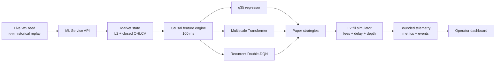

# Arbitrage ML Platform

Сервисная платформа для исследования и paper-тестирования межбиржевого
криптовалютного арбитража по данным L2 order book и OHLCV. Система принимает
рыночный поток с шагом 100 мс, строит единое причинное состояние рынка,
запускает несколько ML-моделей и независимо сравнивает торговые стратегии.


## Что реализовано

- Приём пяти уровней L2 и закрытых свечей `1m`/`5m`.
- Дедупликация неизменившегося стакана без привязки к `machine_ts_final`.
- Общая 100-мс временная сетка и защита от устаревших задач в очереди.
- Legacy q35-регрессор для оценки потенциального схождения спреда.
- Multiscale Transformer для оценки возможности, входа и выхода.
- Рекуррентный Double-DQN с отдельным LSTM-состоянием для каждой пары.
- Независимые paper-стратегии: q35, Transformer, hybrid и RL.
- Реалистичный проход по пяти уровням стакана, задержка исполнения и комиссии.
- MFE/MAE, PnL, drawdown, win rate, latency и операционные метрики.
- Горячая загрузка моделей без остановки API.
- CPU/CUDA-инференс и запуск всей системы через Docker Compose.
- Детерминированный replay исторического рынка без утечки будущего.
- Stateless dashboard без отдельной базы данных.

## Архитектура



Сервисы располагаются рядом:

```text
project/
├── ML_service/          # инференс, состояние рынка и paper trading
├── market_simulator/    # подготовка и воспроизведение исторического потока
└── dashboard_service/   # веб-интерфейс
```

| Сервис | Порт по умолчанию | Назначение |
|---|---:|---|
| `ml-service` | `8080` | API, модели, признаки и paper execution |
| `market-simulator` | `8090` | Управление историческим replay |
| `dashboard-service` | `3000` | Мониторинг пар, моделей и стратегий |

## Модели

### Quantile Regressor

Квантильный регрессор на основе градиентного бустинга предсказывает консервативную q35-оценку будущего схождения спреда. Модель используется как самостоятельный торговый сигнал и как gate для RL-агента. Реализация на scikit-learn исполняется на CPU.

### Multiscale Transformer

Transformer получает локальную и разреженную длинную историю L2/OHLCV. Его
головы оценивают:

- `watch_q35_bps` — консервативный потенциал наблюдаемого спреда;
- `enter_probability` — вероятность качественной точки входа;
- `entry_executable_probability` — исполнимость входа по стакану;
- `enter_now_q35_bps` — ожидаемый результат при входе сейчас;
- `enter_advantage_q35_bps` — преимущество входа сейчас относительно ожидания;
- `exit_probability` и `exit_advantage_bps` — целесообразность выхода.

До первого предсказания требуется около десяти минут непрерывного потока с шагом 100 мс.

### Recurrent Double-DQN

RL-агент принимает действия `WAIT`, `ENTER`, `HOLD`, `EXIT`. После активации
q35-gate сервис восстанавливает recurrent context через burn-in и далее хранит
отдельное LSTM-состояние по каждой паре и направлению. Активный gate не означает
автоматический вход: агент может продолжать возвращать `WAIT`.

## Paper-стратегии

Стратегии описаны декларативно в
[`config/strategies.yaml`](config/strategies.yaml) и не делят позиции между
собой.

| Стратегия | Opportunity | Entry/exit |
|---|---|---|
| `q35_baseline` | q35-регрессор | Порог + ограничение времени |
| `transformer_full` | Transformer q35 | Головы входа и выхода |
| `hybrid_q35_transformer` | Legacy q35 | Transformer управляет таймингом |
| `rl_paper` | Legacy q35 gate | Действия recurrent RL |

По умолчанию активны `q35_baseline` и `rl_paper`. Стратегии можно включать и
приостанавливать через API или dashboard.

## Быстрый старт

### Требования

- Docker Engine с Compose v2;
- минимум 8 ГБ RAM для CPU-запуска;
- NVIDIA Container Toolkit для CUDA;
- три сервисные папки в общей родительской директории.

Создайте локальный конфиг:

```bash
cd ML_service
cp .env.example .env
```

### CPU

```bash
make up
```

### CUDA

Transformer и RL будут работать на GPU, q35 останется на CPU:

```bash
make up-gpu
```

Для выбора конкретной видеокарты укажите в `.env`:

```env
ML_DEVICE=cuda
NVIDIA_VISIBLE_DEVICES=1
```

Проверка CUDA:

```bash
docker compose -f compose.yaml -f compose.cuda.yaml exec ml-service \
  python -c "import torch; print(torch.cuda.is_available(), torch.cuda.get_device_name(0))"
```

### Проверка запуска

```bash
curl http://localhost:8080/health/ready
curl http://localhost:8080/v1/models
```

Dashboard доступен по адресу [http://localhost:3000](http://localhost:3000).
Swagger UI API: [http://localhost:8080/docs](http://localhost:8080/docs).

Порты можно переназначить в `.env`:

```env
ML_PORT=8088
DASHBOARD_PORT=8089
SIM_PORT=8090
```

> API управления стратегиями пока не содержит встроенной авторизации.

## Исторический replay

### Подготовка данных

Исходные parquet-файлы не обязаны быть глобально отсортированы. Подготовщик
выбирает пары с реальным одновременным L2-потоком, проверяет OHLCV и создаёт
компактный replay:

```bash
docker compose --profile replay run --rm market-simulator \
  python -m market_simulator.prepare \
  --l2 /data/l2_raw.parquet \
  --ohlcv /data/ohlcv_raw.parquet \
  --output /prepared \
  --max-pairs 8 \
  --min-concurrent-seconds 900 \
  --overwrite
```

Результат:

```text
simulator_state/
├── l2_selected_sorted.parquet
├── ohlcv_selected_sorted.parquet
├── pairs.json
└── manifest.json
```

### Запуск replay

```bash
make replay
```

Для CUDA:

```bash
make replay-gpu
```

Запуск 15 минут виртуального рынка в реальном темпе:

```bash
curl -X POST http://localhost:8090/v1/replay/start \
  -H 'content-type: application/json' \
  -d '{"speed": 1, "duration_seconds": 900}'
```

`speed: 10` подходит для инфраструктурного smoke-теста. Latency моделей следует
оценивать при `speed: 1`.

OHLCV публикуется причинно: свеча `1m` доступна только после `ts + 60s`, свеча
`5m` — после `ts + 300s`. Перед первым L2-снимком simulator отправляет до
12 часов уже закрытой истории.

## Контракт исполнения

1. Снимки L2 попадают в `MarketStateStore`.
2. Обновления одной пары объединяются по принципу latest-wins.
3. На временной сетке строятся признаки q35, Transformer и RL.
4. Модели формируют независимые предикты.
5. Каждая активная стратегия принимает собственное решение.
6. Решение в момент `t` исполняется по стакану в `t + 100 ms`.
7. Обе ноги используют одинаковое базовое количество актива.
8. Недостаточная глубина или fill share ниже порога отменяют вход.
9. В PnL учитываются четыре taker-комиссии полного торгового круга.

Один процесс Uvicorn является частью контракта. Несколько workers разделят
LSTM-состояния, веса на GPU, позиции и pending fills между процессами.

## Основные API

```text
GET  /health/live
GET  /health/ready
GET  /metrics

GET  /v1/models
POST /v1/models/{name}/load
POST /v1/models/{name}/reload
POST /v1/models/{name}/unload

GET  /v1/pairs
PUT  /v1/pairs/{pair_id}
POST /v1/market/l2/batch
POST /v1/market/ohlcv/batch

GET  /v1/strategies
POST /v1/strategies/{name}/start
POST /v1/strategies/{name}/pause

GET  /v1/paper/positions
GET  /v1/paper/trades
GET  /v1/paper/decisions
GET  /v1/paper/stats

GET  /v1/monitor/overview
GET  /v1/monitor/pairs/{pair_id}/series
```

Prometheus-метрики доступны на `/metrics`. Dashboard запрашивает компактный
overview каждые 600 мс и отдельно получает историю только выбранной пары.

## Конфигурация

| Файл | Назначение |
|---|---|
| `config/service.yaml` | рынок, история, комиссии и paper repository |
| `config/models.yaml` | модели, bundle-директории и устройства |
| `config/strategies.yaml` | источники сигналов и торговые пороги |
| `.env` | порты, CUDA, OHLCV provider и режим хранения |

Текущий allowlist в `service.yaml` пропускает только
`perp_perp_cross_exchange`. Это единая точка ограничения для всех моделей и
стратегий.

## Model bundles

Каждая модель хранится в отдельной директории с явным `manifest.json`:

```text
models/
├── q35_perp/
├── transformer/
└── rl_agent/
```

Сервис не угадывает feature contract по имени файла. Скрипты в `scripts/`
проверяют и упаковывают артефакты перед serving. Бинарные веса и локальные
manifest-файлы исключены из Git по умолчанию; для публичного репозитория можно
использовать Git LFS или отдельный model registry.

## Разработка

```bash
python -m venv .venv
source .venv/bin/activate
pip install -r requirements.txt -r requirements-dev.txt
python -m pytest -q
```

Проверка Compose:

```bash
docker compose -f compose.yaml -f compose.cuda.yaml \
  --profile replay config --quiet
```

## Ограничения

- Реальные задержки бирж, rejects и рассинхронизация двух ордеров требуют
  отдельного execution adapter.
- Комиссии заданы консервативно и должны быть заменены фактическими тарифами.
- Funding, borrow cost и лимиты бирж пока не моделируются.

## Что добавить перед публикацией

- Скриншот общего dashboard.
- Скриншот графика выбранного спреда с entry/exit.
- Таблицу метрик q35 и Transformer на validation/test.
- Схему источника live WebSocket-данных.
- Ссылку на короткое демонстрационное видео.
