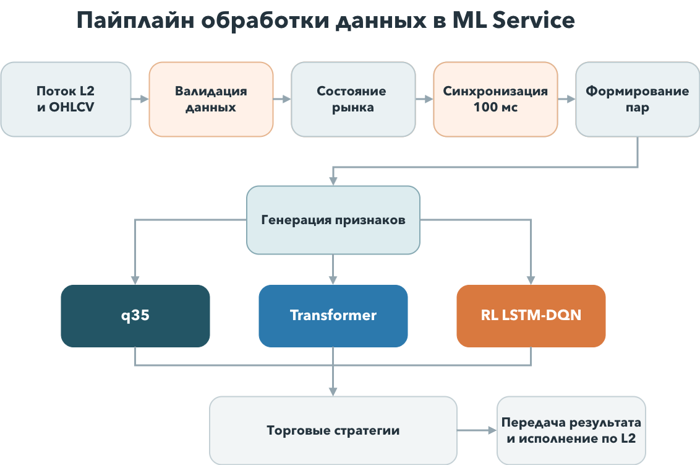
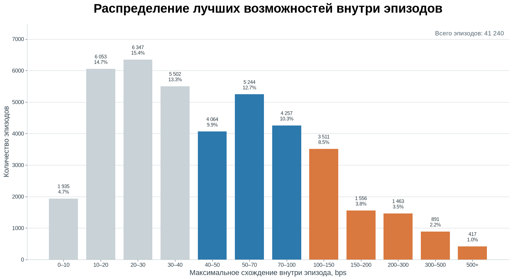
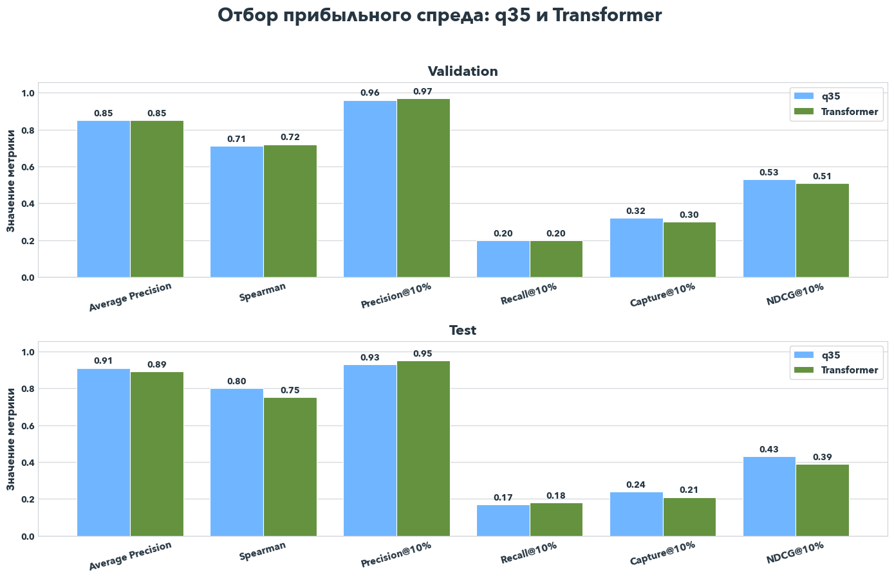
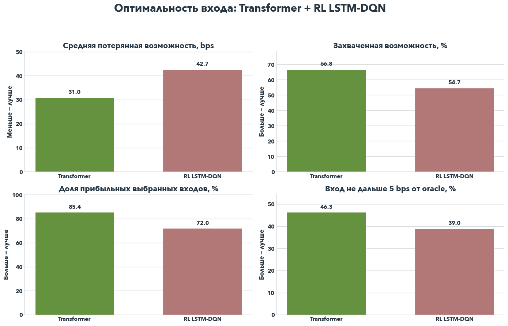
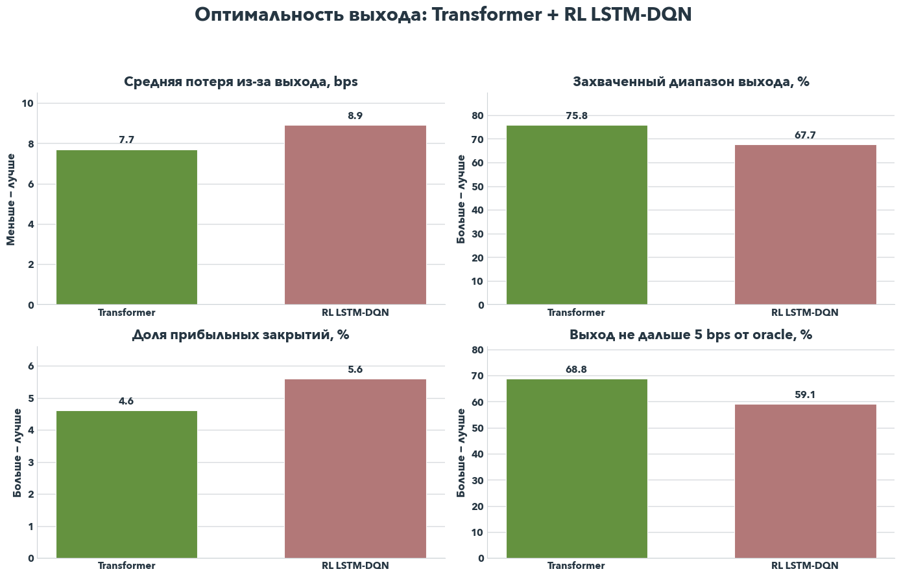
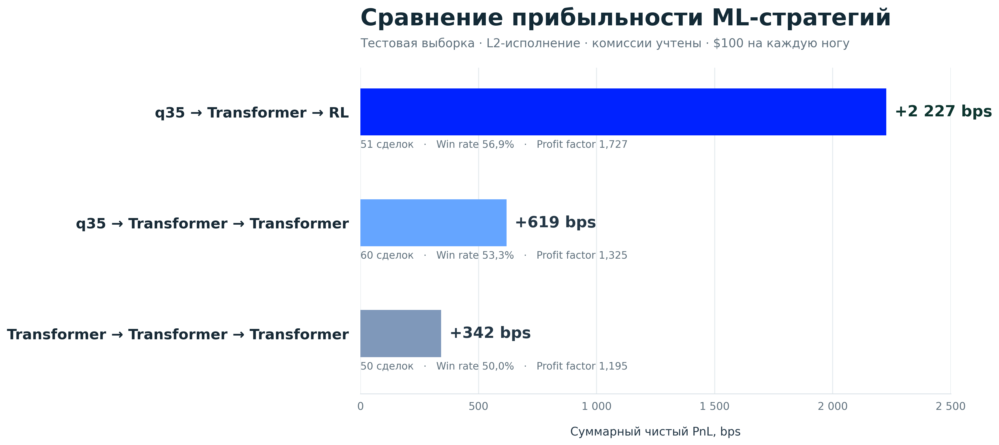
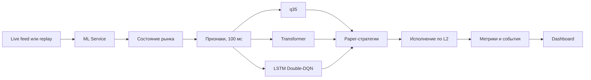

# ML Crypto Arbitrage

Высокочастотная система мониторинга и paper-тестирования арбитражных стратегий
на криптовалютных рынках. Платформа получает L2-стаканы и OHLCV, формирует
межрыночные пары, оценивает перспективность спреда и управляет входом и выходом
с помощью нескольких ML-подходов.

> Идея проекта: не предсказывать цену отдельного актива, а находить временные
> расхождения между связанными рынками и оценивать, можно ли их исполнить с
> учётом глубины стакана, задержки и комиссий.


## Навигация

- [О проекте](#о-проекте)
- [Основные результаты](#основные-результаты)
- [Обработка данных](#обработка-данных)
- [ML-модели](#ml-модели)
- [Архитектура системы](#архитектура-системы)
- [Запуск](#запуск)
- [Исторический replay](#исторический-replay)
- [Структура проекта](#структура-проекта)

## О проекте

Система работает с двумя типами арбитражных пар:

- `spot–perp` на одной бирже;
- `perp–perp` между разными биржами.

Каждые 100 мс сервис обновляет причинное состояние рынка, строит признаки и
получает предсказания моделей. После этого независимые стратегии могут открыть,
удерживать или закрыть paper-позицию. Исполнение моделируется по пяти уровням
L2, а в итоговом PnL учитываются задержка, доступный объём и четыре
taker-комиссии полного торгового круга.

В проекте реализованы:

- обработка L2 и закрытых свечей `1m`/`5m`;
- единая временная сетка 100 мс без использования будущих данных;
- квантильный регрессор, многомасштабный Transformer и RL-агент;
- реалистичный paper execution по глубине стакана;
- детерминированное воспроизведение исторического рынка;
- API и dashboard для наблюдения за моделями и стратегиями.

## Основные результаты

| Этап | Лучший результат |
|---|---:|
| Объём исходных данных | 719,6 млн L2-снимков с 5 бирж |
| Естественные эпизоды спреда | 41 240 |
| Эпизоды со схождением не менее 40 bps | 51,9% |
| Отбор спреда, q35 | Average Precision 0,908; Spearman 0,799 |
| Выбор входа, Transformer | 85,4% прибыльных входов |
| Потеря относительно лучшего входа | 31,0 bps |
| Потеря относительно лучшего выхода | 7,7 bps |

Все значения получены на зафиксированных validation/test-интервалах
исторического рынка. Это offline-оценка исследовательской paper-системы, а не
гарантия доходности в live-торговле.

## Обработка данных



Данные проходят валидацию и дедупликацию, после чего последние доступные
L2-снимки и только закрытые OHLCV-свечи объединяются в причинное состояние
рынка. Для совместимых инструментов строятся оба направления сделки и признаки
для моделей.

### Распределение возможностей

На графике показано максимальное схождение, которое наблюдалось внутри каждого
естественного эпизода спреда.



## ML-модели

### Q35 Regressor

Квантильный `HistGradientBoostingRegressor` оценивает величину будущего
схождения. Регрессия с пороговым отбором сохранила информацию о размере
возможности, а квантиль `q35` снизил риск опасных завышений прогноза.

### Multiscale Transformer

Две attention-ветви анализируют плотную локальную и разреженную долгосрочную
историю L2. Полученное представление объединяется с OHLCV и категориальными
признаками пары. Отдельные головы оценивают перспективность спреда, качество
входа и целесообразность выхода.

### LSTM Double-DQN

MLP-кодировщик и LSTM сохраняют историю рынка, после чего Q-голова выбирает
действие `WAIT`, `ENTER`, `HOLD` или `EXIT`. Агент активируется после
предварительного q35-отбора, чтобы обучаться на более информативных рыночных
последовательностях.

### Отбор прибыльного спреда



### Оптимальность входа



### Оптимальность выхода



### Сравнение полных стратегий



Сравнение выполнено в offline backtest на историческом test-потоке с одинаковым
контрактом комиссий и исполнения.

## Архитектура системы



| Сервис | Порт | Назначение |
|---|---:|---|
| [`ML_service`](ML_service/README.md) | `8080` | Состояние рынка, признаки, модели и paper trading |
| [`market_simulator`](market_simulator/README.md) | `8090` | Подготовка и воспроизведение исторического потока |
| [`dashboard_service`](dashboard_service/README.md) | `3000` | Интерфейс оператора |

## Запуск

### Docker Compose

```bash
cd ML_service
cp .env.example .env
docker compose up -d --build ml-service dashboard-service
```

После запуска:

- Dashboard: [http://localhost:3000](http://localhost:3000)
- ML API: [http://localhost:8080/docs](http://localhost:8080/docs)
- Проверка готовности: [http://localhost:8080/health/ready](http://localhost:8080/health/ready)

### CUDA

Для запуска Transformer и RL на NVIDIA GPU:

```bash
cd ML_service
docker compose -f compose.yaml -f compose.cuda.yaml up -d --build
```

Конкретную видеокарту можно выбрать в `.env`:

```env
ML_DEVICE=cuda
NVIDIA_VISIBLE_DEVICES=0
```

Q35-модель всегда выполняется на CPU.

## Исторический replay

Большие рыночные данные намеренно не хранятся в репозитории. Для replay
положите файлы:

```text
ML_service/raw_last_3d/
├── l2_raw.parquet
└── ohlcv_raw.parquet
```

Подготовьте компактный участок рынка:

```bash
cd ML_service
docker compose --profile replay run --rm market-simulator \
  python -m market_simulator.prepare \
  --l2 /data/l2_raw.parquet \
  --ohlcv /data/ohlcv_raw.parquet \
  --output /prepared \
  --max-pairs 8 \
  --min-concurrent-seconds 900 \
  --overwrite
```

Запустите сервисы:

```bash
docker compose --profile replay up -d --build
```

Запустите 15 минут виртуального рынка:

```bash
curl -X POST http://localhost:8090/v1/replay/start \
  -H 'content-type: application/json' \
  -d '{"speed": 1, "duration_seconds": 900}'
```

## Тесты

```bash
cd ML_service
python -m pytest -q

cd ../market_simulator
python -m pytest -q
```

Тесты проверяют причинную обработку признаков, контракты моделей, исполнение по
стакану, работу paper-движка и корректность исторического replay.

## Структура проекта

```text
ML_crypto_arb/
├── assets/                  # графики и изображения README
├── ML_service/              # ML-инференс и paper trading
│   ├── config/              # модели, стратегии и параметры сервиса
│   ├── models/              # готовые model bundles
│   ├── scripts/             # упаковка обученных моделей
│   ├── src/ml_service/      # API, признаки, модели и execution
│   └── tests/
├── market_simulator/        # исторический replay L2/OHLCV
│   ├── src/market_simulator/
│   └── tests/
├── dashboard_service/       # статический интерфейс оператора
│   └── web/
├── .gitignore
└── README.md
```

## Технологии

- Python, FastAPI, Polars и NumPy;
- scikit-learn и PyTorch;
- L2 order book и OHLCV;
- Docker Compose и NVIDIA CUDA;
- HTML, CSS, JavaScript и Nginx;
- SQLite или in-memory paper state.

## Ограничения

Проект предназначен для исследования и paper-тестирования. Для реального
исполнения потребуются биржевые адаптеры, контроль частичных исполнений,
аутентификация операторского API, риск-лимиты и мониторинг сетевых отказов.
