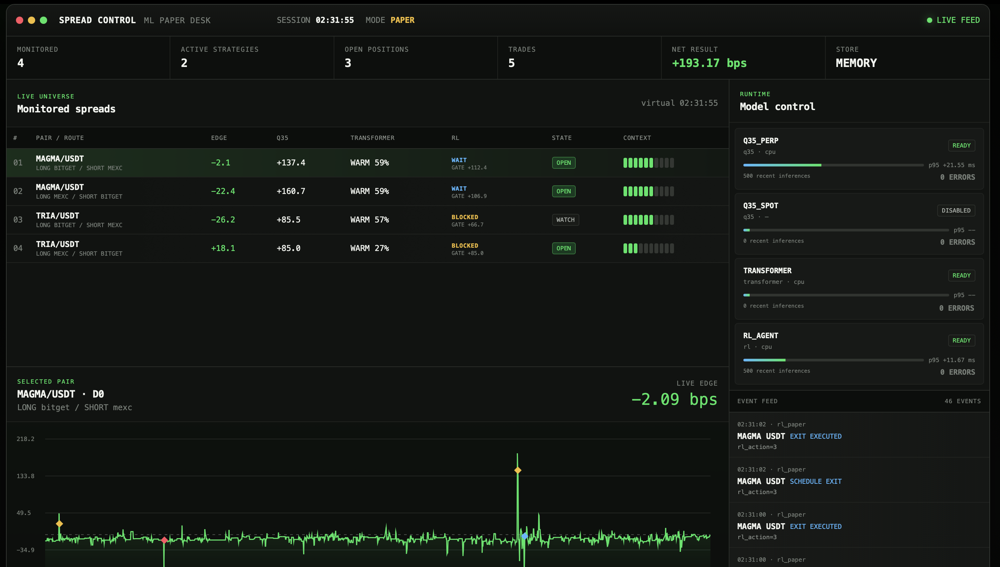

# Operator Dashboard

Минималистичный stateless-интерфейс для наблюдения за `ML_service` в paper
режиме. Веб-сервис не хранит рыночные данные и не участвует в инференсе:
Nginx раздаёт статические HTML/CSS/JS и проксирует `/api/*` в ML API.



## Что отображается

- Стабильный список отслеживаемых пар без пересортировки по текущему edge.
- Live edge, q35, прогрев Transformer и состояние RL-gate.
- Состояние, устройство и p95 latency каждой модели.
- Активные paper-стратегии и управление `start/pause`.
- Открытые позиции, события и закрытые сделки.
- PnL, win rate, drawdown, MFE/MAE и среднее время удержания.
- График выбранного спреда с отметками entry/exit.

## Запуск

Dashboard рассчитан на запуск рядом с `ML_service`:

```bash
cd ../ML_service
docker compose up -d --build ml-service dashboard-service
```

Откройте [http://localhost:3000](http://localhost:3000).

Для замены портов можно использовать .env:

```env
ML_PORT=8089
DASHBOARD_PORT=8088
```

## Устройство

```text
browser
  ├── /                 -> static dashboard
  └── /api/*            -> ml-service:8080/*
```

Overview обновляется каждые 600 мс. История графика загружается только для
выбранной пары, поэтому число контролируемых пар не увеличивает объём всех
chart-запросов.

Dashboard намеренно не использует SQLite. Paper state и ограниченная история
находятся в `ML_service`, поэтому перезапуск UI не влияет на модели и позиции.

## Локальная проверка

Dashboard ожидает DNS-имя `ml-service`, поэтому его удобнее запускать общим
Compose-файлом:

```bash
cd ../ML_service
docker compose up --build ml-service dashboard-service
```

Health endpoint:

```bash
curl http://localhost:3000/health/live
```
